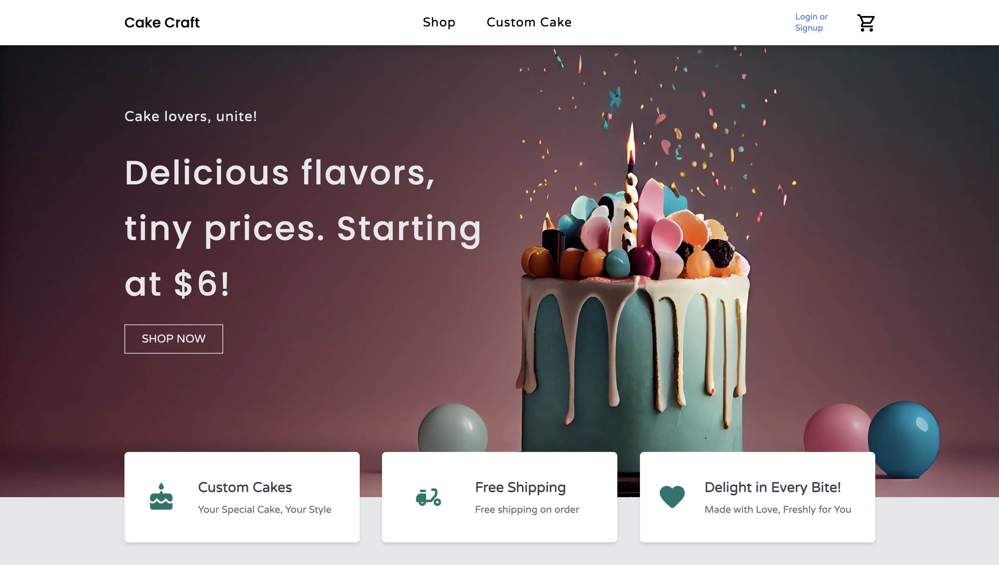

# 🍰 Cake Craft - Premium Cake Business Frontend

A modern, responsive web application for a premium cake business built with Next.js, React, and Tailwind CSS. This frontend showcases beautiful cakes and cupcakes with an elegant user interface and smooth animations.

## 📸 Screenshots


_Main homepage showcasing featured products and hero section_


_Product catalog with cake and cupcake listings_


_Detailed product view with pricing and descriptions_

## ✨ Features

- **Modern UI/UX**: Clean, responsive design with smooth animations
- **Product Showcase**: Beautiful display of cakes and cupcakes
- **Shopping Cart**: Add items to cart functionality
- **User Authentication**: NextAuth.js integration for user management
- **Responsive Design**: Works seamlessly on desktop, tablet, and mobile
- **Smooth Scrolling**: Enhanced user experience with Lenis smooth scrolling
- **Custom Animations**: Framer Motion animations for engaging interactions
- **Product Categories**: Organized display of different cake types
- **Custom Cake Orders**: Special section for custom cake requests

## 🛠️ Tech Stack

- **Framework**: Next.js 14
- **Frontend**: React 18
- **Styling**: Tailwind CSS
- **UI Components**: Material-UI (MUI)
- **Animations**: Framer Motion
- **Authentication**: NextAuth.js
- **Smooth Scrolling**: React Lenis
- **Special Effects**: React Snowfall

## 🚀 Getting Started

### Prerequisites

- Node.js (version 16 or higher)
- npm or yarn package manager

### Installation

1. **Clone the repository**

   ```bash
   git clone <your-repository-url>
   cd cup-cakes
   ```

2. **Install dependencies**

   ```bash
   npm install
   # or
   yarn install
   ```

3. **Run the development server**

   ```bash
   npm run dev
   # or
   yarn dev
   ```

4. **Open your browser**
   Navigate to [http://localhost:3000](http://localhost:3000) to view the application.

### Available Scripts

- `npm run dev` - Start development server
- `npm run build` - Build for production
- `npm run start` - Start production server
- `npm run lint` - Run ESLint

## 📁 Project Structure

```
cup-cakes/
├── components/          # Reusable React components
│   ├── home/           # Homepage components
│   ├── navbar/         # Navigation components
│   ├── footer/         # Footer components
│   ├── product-cards/  # Product display components
│   └── layout/         # Layout components
├── pages/              # Next.js pages
│   ├── api/           # API routes
│   ├── products/      # Product pages
│   └── shop/          # Shop pages
├── public/            # Static assets
│   ├── birthday-cakes/ # Birthday cake images
│   ├── cup-cakes/     # Cupcake images
│   └── *.js           # Product data files
└── styles/            # Global styles
```

## 🎂 Product Categories

### Cakes

- Strawberry Cake (LKR 400.00)
- Vanilla Cake (LKR 350.00)
- Mint Choc-Chip Cake (LKR 450.00)

### Cupcakes

- Strawberry Cupcake (LKR 400.00)
- Vanilla Cupcake (LKR 350.00)
- Mint Choc-Chip Cupcake (LKR 450.00)

## 🔧 Configuration

The project uses several configuration files:

- `next.config.js` - Next.js configuration
- `tailwind.config.js` - Tailwind CSS configuration
- `postcss.config.js` - PostCSS configuration
- `jsconfig.json` - JavaScript path mapping

## 🌟 Key Features

- **Hero Section**: Eye-catching landing area with call-to-action
- **Product Grid**: Organized display of cakes and cupcakes
- **Trending Section**: Highlighted popular products
- **Custom Cake Orders**: Special section for custom requests
- **Responsive Navigation**: Mobile-friendly navigation menu
- **Shopping Cart**: Add to cart functionality
- **User Profile**: User account management

## 📱 Responsive Design

The application is fully responsive and optimized for:

- Desktop (1024px and above)
- Tablet (768px - 1023px)
- Mobile (320px - 767px)

## 🎨 Design Features

- Modern gradient backgrounds
- Smooth hover effects
- Professional typography
- High-quality product images
- Consistent color scheme
- Intuitive user interface

## 🤝 Contributing

1. Fork the repository
2. Create a feature branch (`git checkout -b feature/AmazingFeature`)
3. Commit your changes (`git commit -m 'Add some AmazingFeature'`)
4. Push to the branch (`git push origin feature/AmazingFeature`)
5. Open a Pull Request

## 📄 License

This project is licensed under the MIT License - see the LICENSE file for details.

## 📞 Support

For support and questions, please contact the development team or create an issue in the repository.

---

**Made with ❤️ for the cake business community**
